# GoldenPegasus — Website Flow Diagram

```mermaid
flowchart TB
    %% ── LANDING & AUTH ──
    LANDING["🏠 Landing Page
    /"] --> ADMIN_LOGIN["🔑 Admin Login
    /admin-login"]
    LANDING --> EMP_LOGIN["👤 Employee Login
    /login"]
    LANDING --> SIGNUP["📝 Employee Sign Up
    /signup"]

    SIGNUP --> VERIFY_EMAIL["📧 Verify Email
    Sent confirmation link"]
    VERIFY_EMAIL --> EMP_LOGIN

    ADMIN_LOGIN --> ADMIN_CHECK{"✅ Auth Check
    • Email confirmed?
    • Role = admin?
    • Must change password?"}
    ADMIN_CHECK -- "No" --> ADMIN_LOGIN
    ADMIN_CHECK -- "Yes, must change password" --> ADMIN_CHANGE_PW["🔐 Force Password Change
    /admin-change-password"]
    ADMIN_CHANGE_PW --> ADMIN

    EMP_LOGIN --> EMP_CHECK{"✅ Auth Check
    • Email confirmed?
    • Role = employee?
    • Not an admin?"}
    EMP_CHECK -- "No" --> EMP_LOGIN
    EMP_CHECK -- "Yes" --> DASHBOARD

    %% ── AUTH CALLBACK ──
    AUTH_CALLBACK["🔄 Auth Callback Handler
    /auth/callback
    (redirects to /auth/verify)"] --> AUTH_VERIFY["✅ Client-side Token Exchange
    /auth/verify
    • Handles OTP, recovery, email confirmation
    • Module-level flag prevents duplicate processing"]
    AUTH_VERIFY --> ADMIN_LOGIN
    AUTH_VERIFY --> EMP_LOGIN

    %% ── ADMIN SIDEBAR ──
    subgraph ADMIN_SECTION["🔷 ADMIN PANEL"]
        ADMIN["📊 Overview
        /admin
        Stats cards for:
        Employees · Admins · Marketing
        Clients · Dynamic Tables · Technology Table"]

        PERSONAL["👤 Personal Details
        /admin/profile
        View/edit profile info
        Change password"]

        ADMINS["🔑 Admin List
        /admin/admins
        View all admins"]

        REGISTER_ADMIN["➕ Register Admin
        /admin/register
        Create new admin account"]

        EMPLOYEES["👥 Employees
        /admin/employees
        CRUD employee accounts
        Search · Filter · Edit · Delete"]

        ALL_MARKETING["📈 All Marketing Records
        /admin/marketing
        Full CRUD · Search · Filter
        Import Excel · Export CSV/PDF
        Bulk Edit · Bulk Delete
        Cleanup (normalize names)
        Sort by Created Date ↓"]

        ALL_CANDIDATES["🤝 All Candidate Profiles
        /admin/clients
        Full CRUD · Search · Filter
        Export CSV/PDF · Bulk Edit"]

        ALL_PROJECTS["🗂️ All Project Records
        /admin/projects
        Full CRUD · Search · Filter
        Export CSV/PDF · Bulk Edit
        Status/Type dropdowns"]

        DYN_TABLES["🏗️ Dynamic Tables
        /admin/tables
        Create custom tables
        Manage records · Permissions"]

        TECH_TABLE["📋 Technology Table
        /admin/base-table
        Manage Technologies &
        Sub-Technologies
        (renamed from Base Table)"]

        AUDIT["📋 Audit Log History
        /admin/audit
        Day/week grouped logs
        Filter by action/entity"]
    end

    %% ── EMPLOYEE SIDEBAR ──
    subgraph EMP_SECTION["🟢 EMPLOYEE PANEL"]
        DASHBOARD["🏠 Overview
        /dashboard
        Stats: My Marketing · Tables
        Projects · Candidates"]

        EMP_PERSONAL["👤 Personal Details
        /dashboard/profile
        View/edit profile
        (employee_id, contact,
         designation, joining_date
         lock after first save)"]

        ALL_MARKETING_VIEW["📊 All Marketing Records
        /dashboard/marketing
        Read-only view of all records
        Search · Filter · Export"]

        MY_MARKETING["📈 My Marketing Records
        /dashboard/my-marketing
        CRUD on own records
        (no delete button)
        Import Excel · Export
        Search · Filter"]

        ALL_CANDIDATES_VIEW["🤝 All Candidate Profiles
        /dashboard/all-marketing-profiles
        Read-only, deduplicated
        Search · Filter · Export"]

        MY_CANDIDATES["👤 My Candidate Profile
        /dashboard/clients
        Own + backup candidates
        CRUD · Search · Filter · Export"]

        ALL_PROJECTS_VIEW["🗂️ All Project Records
        /dashboard/all-projects
        Read-only view
        Search · Filter · Export"]

        MY_PROJECTS["📋 My Project Records
        /dashboard/projects
        Own projects
        CRUD · Search · Filter · Export"]

        CUSTOM_TABLES["🏗️ Custom Tables
        /dashboard/tables
        Manage dynamic table records"]
    end

    %% ── NAVIGATION ──
    ADMIN --> PERSONAL
    ADMIN --> ADMINS
    ADMINS --> REGISTER_ADMIN
    ADMIN --> EMPLOYEES
    ADMIN --> ALL_MARKETING
    ADMIN --> ALL_CANDIDATES
    ADMIN --> ALL_PROJECTS
    ADMIN --> DYN_TABLES
    ADMIN --> TECH_TABLE
    ADMIN --> AUDIT

    DASHBOARD --> EMP_PERSONAL
    DASHBOARD --> ALL_MARKETING_VIEW
    DASHBOARD --> MY_MARKETING
    DASHBOARD --> ALL_CANDIDATES_VIEW
    DASHBOARD --> MY_CANDIDATES
    DASHBOARD --> ALL_PROJECTS_VIEW
    DASHBOARD --> MY_PROJECTS
    DASHBOARD --> CUSTOM_TABLES

    %% ── DATA LAYER ──
    subgraph DATA["📦 DATA LAYER"]
        SUPABASE["🗄️ Supabase
        • Authentication
        • Database (PostgreSQL)
        • Row Level Security (RLS)
        • Edge Functions"]

        API["🌐 Next.js API Routes
        /api/marketing
        /api/candidates
        /api/projects
        /api/technologies
        /api/tables
        /api/audit
        /api/search
        /api/profile/save
        /api/admin/*"]

        SRV["🖥️ Server Components
        Fetch data directly from
        Supabase (bypass RLS with
        service_role key for admin)"]

        CLIENT["💻 Client Components
        Fetch via API routes
        React state management
        Real-time updates via polling"]
    end

    ADMIN_SECTION --> SRV
    ADMIN_SECTION --> CLIENT
    EMP_SECTION --> SRV
    EMP_SECTION --> CLIENT
    SRV --> SUPABASE
    CLIENT --> API
    API --> SUPABASE

    %% ── SHARED COMPONENTS ──
    subgraph COMPONENTS["🧩 SHARED UI COMPONENTS"]
        SIDEBAR["📌 Sidebar
        Role-based nav items
        Collapsible · Brand logo"]
        SESSION_GUARD["🛡️ SessionGuard
        Cross-tab auth listener
        Redirects on role mismatch"]
        SIGN_OUT["🚪 SignOutButton
        Clears cookies + localStorage
        Redirects to login"]
        MARKETING_TABLE["📊 MarketingTable
        Full-featured data table
        CRUD · Search · Filter · Sort
        Import Excel · Export CSV/PDF
        Pagination · Bulk Actions"]
        CLIENTS_TABLE["🤝 ClientsTable
        Candidate profiles table
        CRUD · Search · Filter · Export
        Country code phone input"]
        PROJECTS_TABLE["🗂️ ProjectsTable
        Project records table
        CRUD · Search · Filter · Export
        Status/Type dropdowns"]
        DYN_TABLE_COMP["🏗️ DynamicTables
        Custom schema builder
        Record management
        Permission controls"]
    end

    ALL_MARKETING --> MARKETING_TABLE
    MY_MARKETING --> MARKETING_TABLE
    ALL_MARKETING_VIEW --> MARKETING_TABLE
    ALL_CANDIDATES --> CLIENTS_TABLE
    ALL_CANDIDATES_VIEW --> CLIENTS_TABLE
    MY_CANDIDATES --> CLIENTS_TABLE
    ALL_PROJECTS --> PROJECTS_TABLE
    ALL_PROJECTS_VIEW --> PROJECTS_TABLE
    MY_PROJECTS --> PROJECTS_TABLE
    DYN_TABLES --> DYN_TABLE_COMP
    CUSTOM_TABLES --> DYN_TABLE_COMP

    ADMIN_SIDEBAR_INST["📌 Sidebar (Admin)"] --> SIDEBAR
    EMP_SIDEBAR_INST["📌 Sidebar (Employee)"] --> SIDEBAR

    %% ── KEY FEATURES ──
    subgraph FEATURES["✨ KEY FEATURES"]
        IMPORT["📥 Import Excel
        • Parses XLSX/CSV
        • Auto-maps column headers
        • Batch inserts marketing records
        • Duplicate detection
        • Validation & error reporting"]

        EXPORT["📤 Export CSV/PDF
        • All filtered records
        • CSV: comma-separated
        • PDF: jsPDF with autoTable
        • Landscape layout
        • Green header styling"]

        FORGOT_PW["🔐 Password Reset
        /forgot-password → email
        → /reset-password
        → /auth/verify (PKCE)"]

        SEARCH["🔍 Global Search
        /api/search
        Searches across:
        • Marketing records
        • Employees
        • Candidates
        • Admins"]

        CLEANUP["🧹 Marketing Cleanup
        • Normalize company names
        • Fix email formats
        • Remove duplicates
        • Normalize technologies"]

        REMINDERS["⏰ Auto-Reminders
        pg_cron edge function
        every 5 minutes
        Sends marketing reminders"]
    end

    ALL_MARKETING --> IMPORT
    MY_MARKETING --> IMPORT
    ALL_MARKETING --> EXPORT
    MY_MARKETING --> EXPORT
    ALL_CANDIDATES --> EXPORT
    ALL_PROJECTS --> EXPORT
    ADMIN --> CLEANUP
```

## How to Read This Diagram

| Color | Meaning |
|-------|---------|
| 🔷 **Blue** | Admin panel — accessible only by admins |
| 🟢 **Green** | Employee panel — accessible only by employees |
| 📦 **Orange** | Data layer — how data flows |
| 🧩 **Purple** | Shared components reused across pages |
| ✨ **Teal** | Key features available in the system |

## Flow Summary

1. **Entry**: Everyone starts at the Landing Page → chooses Admin Login, Employee Login, or Sign Up
2. **Authentication**: Supabase Auth verifies email/password, checks email confirmation, validates role
3. **Role Separation**:
   - Admins go to `/admin` with full CRUD access
   - Employees go to `/dashboard` with restricted access
4. **Data Flow**:
   - **Server Components** query Supabase directly (with service_role key for admin data)
   - **Client Components** call Next.js API routes which query Supabase
   - Tables use client-side state for interactivity (search, filter, sort, pagination)
5. **Key Pages**:
   - **Marketing Records**: Full CRUD table with import/export, bulk actions, cleanup
   - **Candidate Profiles**: Manage candidate data with tech/backup tracking
   - **Project Records**: Track project assignments with status/type
   - **Dynamic Tables**: User-created custom tables
   - **Technology Table**: Manage tech/sub-tech taxonomy
   - **Audit Logs**: Activity tracking for admin actions
6. **Cross-cutting**: SessionGuard ensures role consistency across tabs, SignOutButton cleans up all auth state
